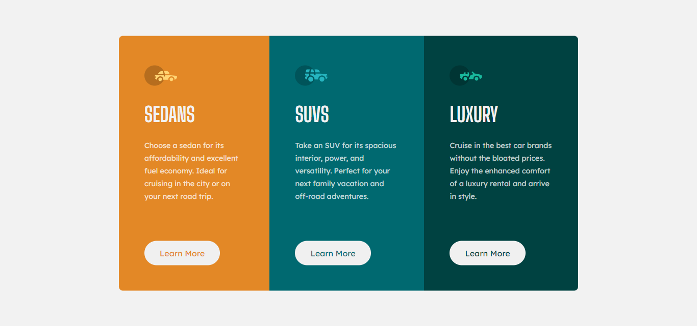

# Frontend Mentor | 3-column preview card component

Esta é uma solução para o [3-column preview card component challenge on Frontend Mentor](https://www.frontendmentor.io/challenges/3column-preview-card-component-pH92eAR2-/hub).
Os desafios do Frontend Mentor ajudam você a melhorar suas habilidades de codificação através da construção de projetos realistas.

### Screenshot

### Construído com

- Marcação HTML5 semântica
- Media Queries
- Grade CSS
- Ultilizando o conceito Mobile first
  - Mobile first é um projeto que faz a criação de projetos web e sites primeiro em dispositivos móveis, para depois fazer adaptações para o desktop e outras plataformas, ao contrário do que ainda acontece na maioria das vezes.
